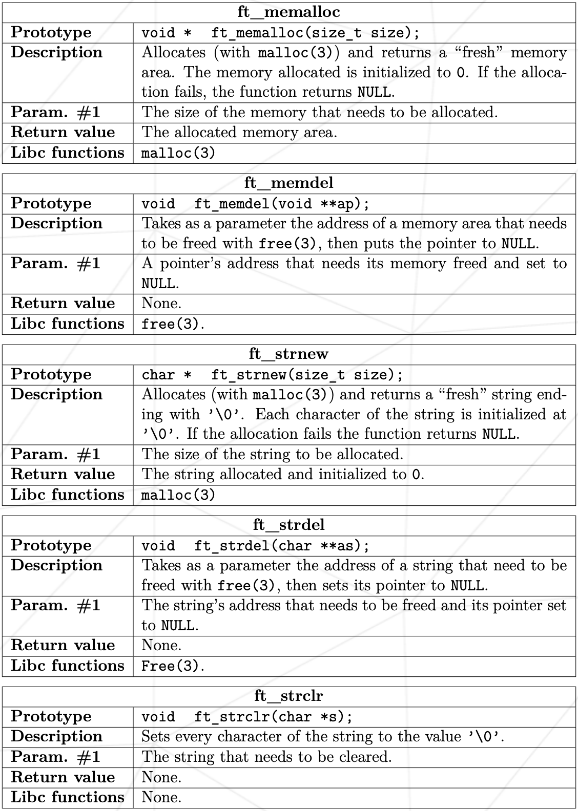
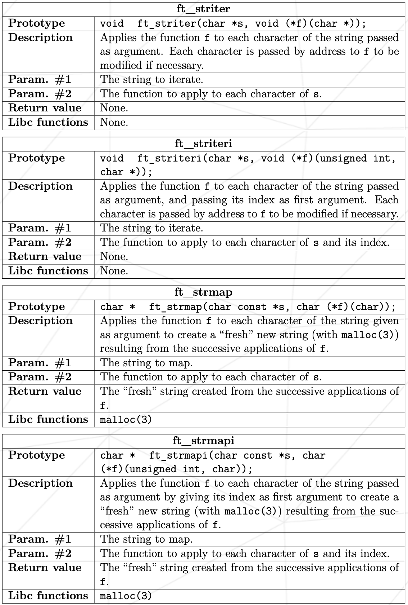
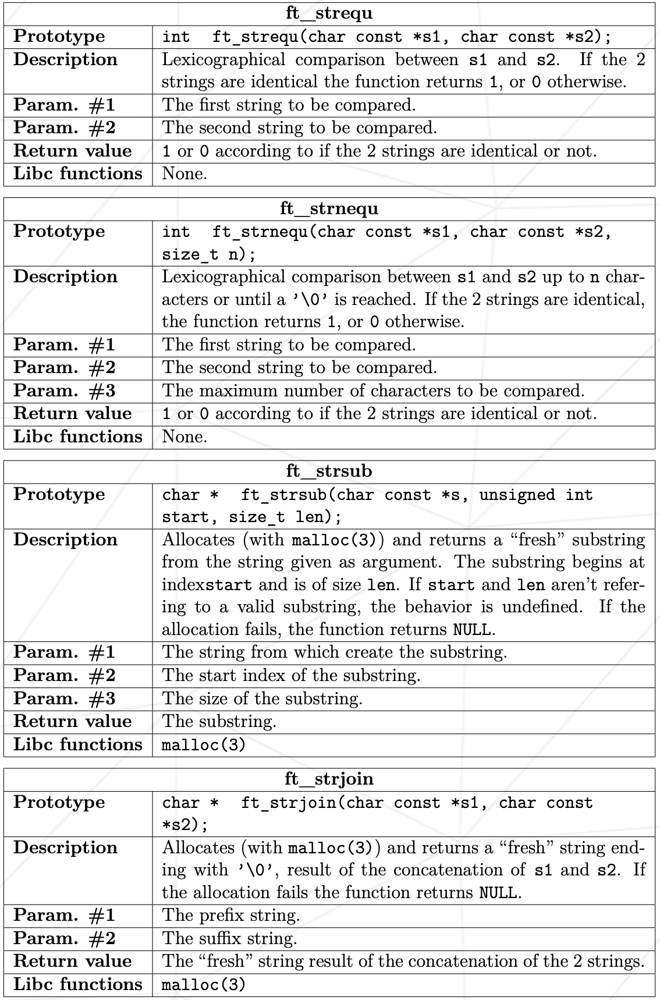
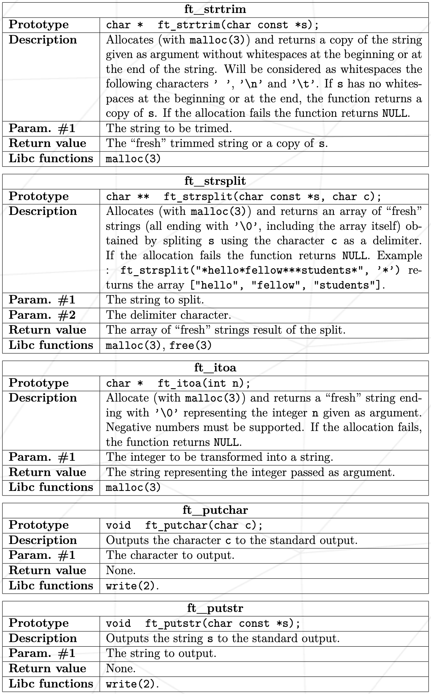
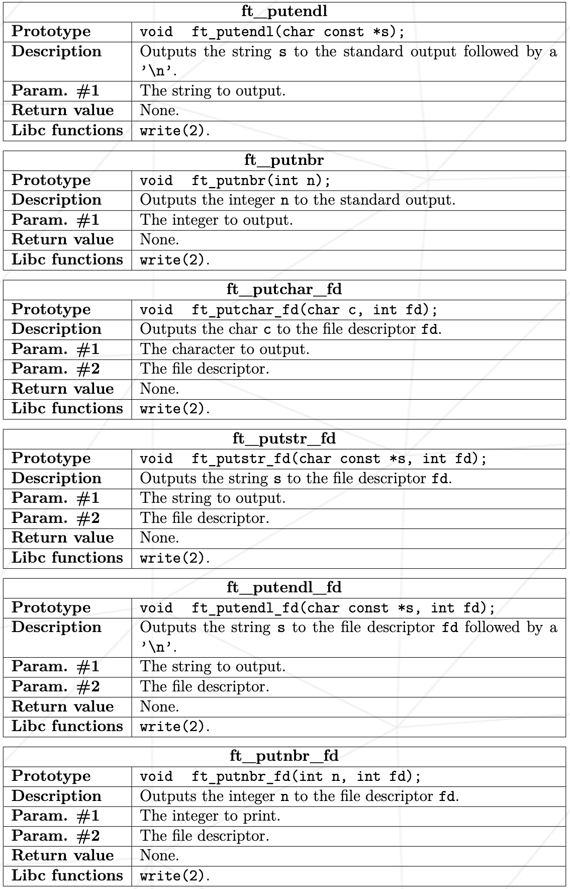
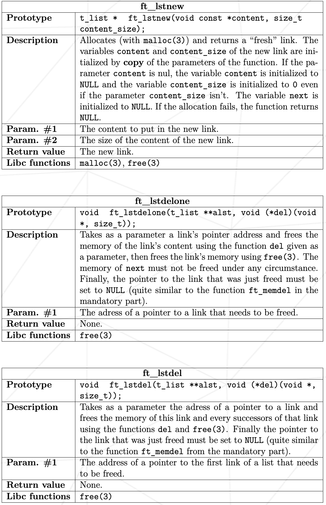
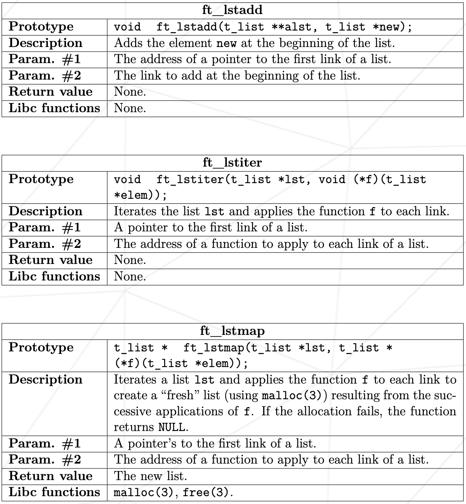

# libft
>	This is a 1337 school project, all functions except malloc/free/read are prohibited by the school and flagged as a cheat,
>this library allows me to use functions like ft_memcpy or ft_printf.

##-usage

>**make** to compile the library
>**make clean** to delet the object files
>**make fclean* to delet the object files and the library file
>**make re** to recompile

##-included fonctions

* **memset**
* **bzero**
* **memcpy**
* **memccpy**
* **memmove**
* **memchr**
* **memcmp**
* **strlen**
* **strdup**
* **strcpy**
* **strncpy**
* **strcat**
* **strncat**
* **strlcat**
* **strchr**
* **strrchr**
* **strstr**
* **strnstr**
* **strcmp**
* **strncmp**
* **atoi**
* **isalpha**
* **isdigit**
* **isalnum**
* **isascii**
* **isprint**
* **toupper**
* **tolower**

##-Additional functions

* 
* 
* 
* 
* 
* 
* 
